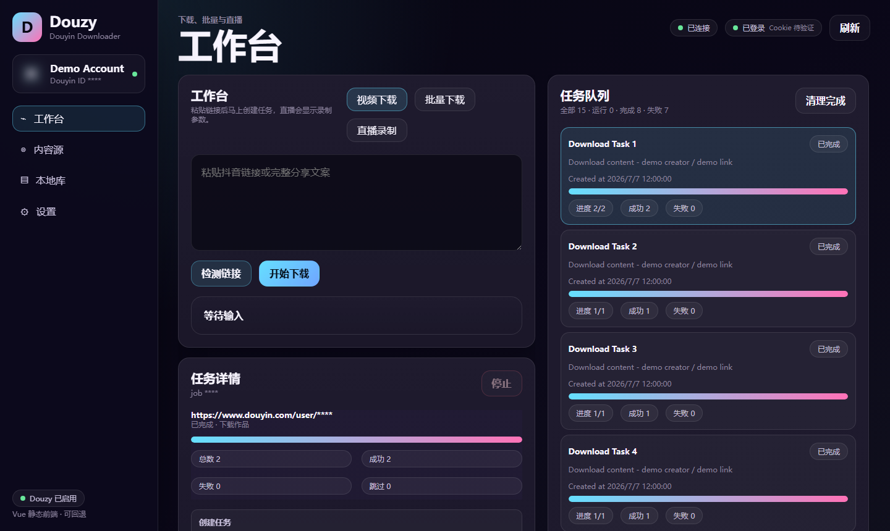
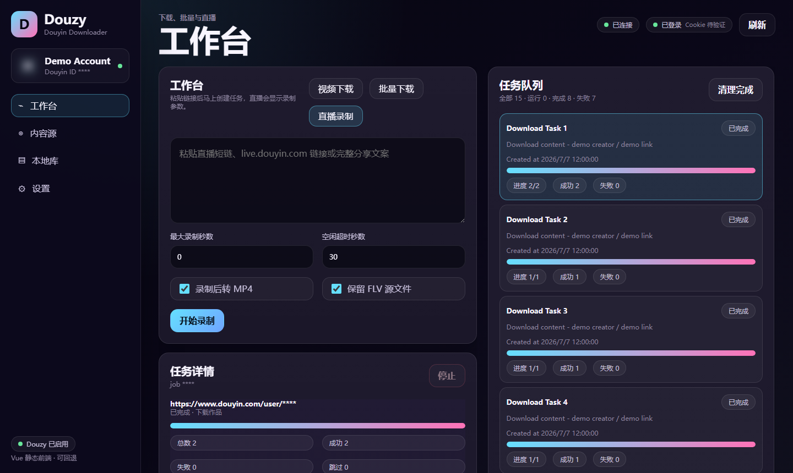
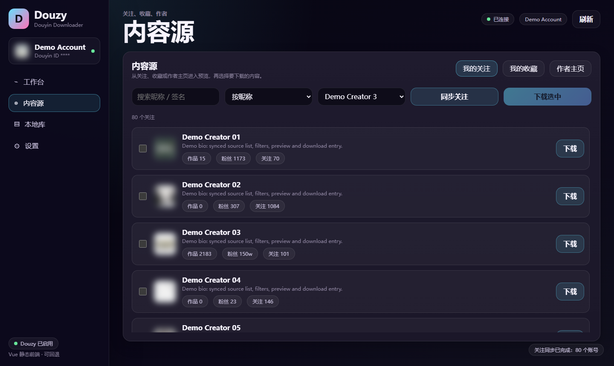
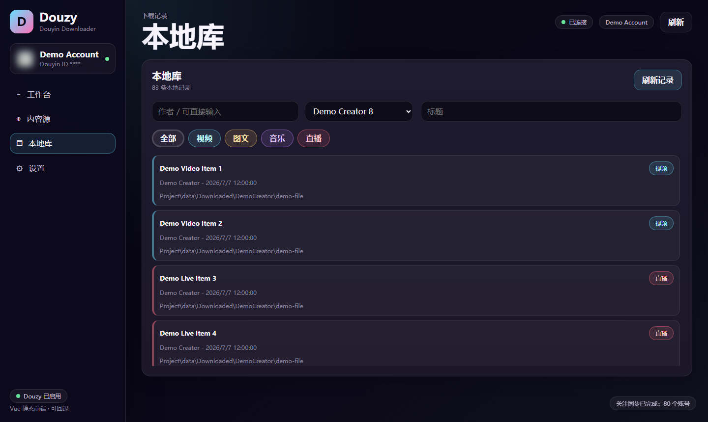
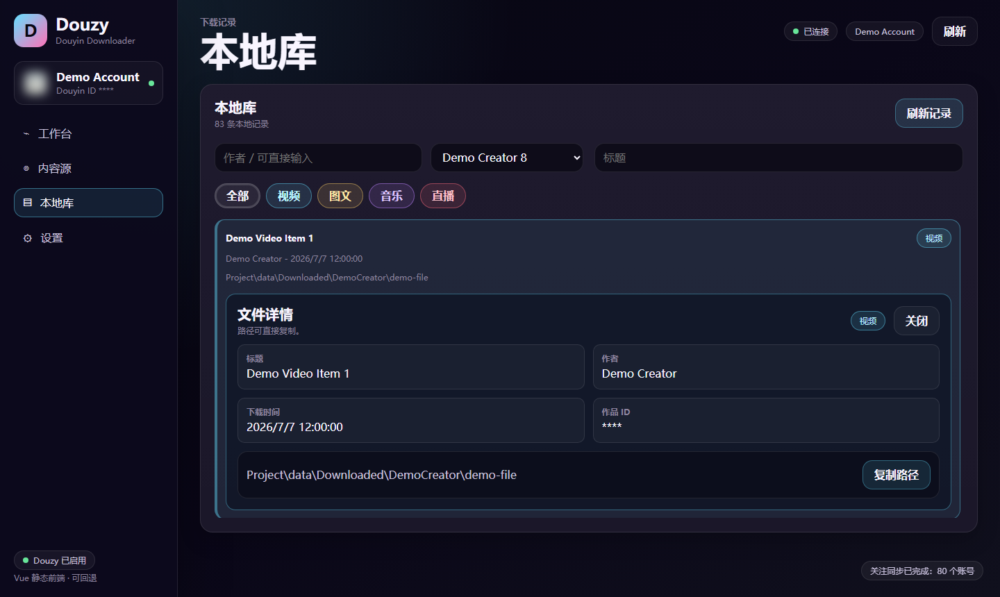
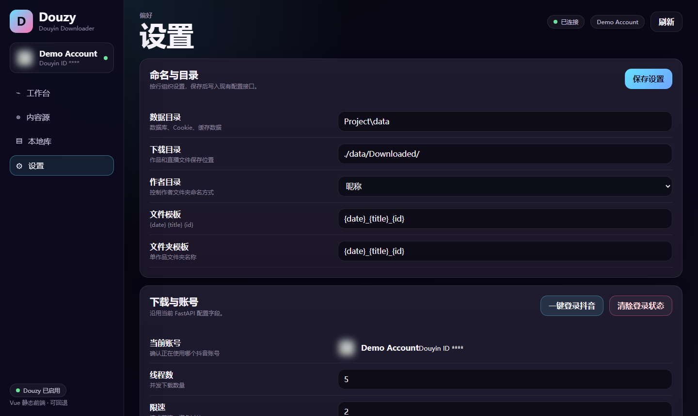

# dy-downloader

源码部署版抖音下载与本地管理工具。它基于 `jiji262/douyin-downloader` 的下载能力扩展了 Web 前端、账号登录、任务队列、内容源预览、本地库、直播录制和运行数据隔离。

前端是 Vue 静态模块 + 原生 CSS，后端是 FastAPI + Python 下载器；不是 Electron / Tauri 桌面壳。启动后在浏览器访问 `http://127.0.0.1:8000`。

> 截图来自本程序当前界面，账号、头像、作者、作品标题和本机路径已脱敏。

## 界面预览

| 工作台：视频、批量与任务队列 | 直播录制：转 MP4 与保留 FLV |
| --- | --- |
|  |  |

| 内容源：关注、收藏、作者主页 | 本地库：类型标签与动态作者筛选 |
| --- | --- |
|  |  |

| 本地库文件详情 | 设置：目录、命名、账号与附件 |
| --- | --- |
|  |  |

## 主要功能

- 链接下载：支持抖音视频、图文、合集、音乐链接，也支持完整分享文案自动提取链接。
- 批量下载：每行一个链接或分享文案，统一创建任务。
- 内容源：登录后同步“我的关注”和“我的收藏”，也可以粘贴作者主页链接进入预览。
- 作者预览：从作者卡片进入作品、喜欢、合集、音乐列表，筛选后选择单个或多个内容下载。
- 任务队列：任务创建、运行、完成、失败状态持久化保存，进度按任务实时展示。
- 本地库：SQLite 保存下载记录，支持作者下拉动态更新、手动输入作者、标题搜索和视频/图文/音乐/直播标签筛选。
- 文件详情：双击本地库记录后在该记录下展开详情，只保留一个详情面板，可直接复制路径。
- 直播录制：支持直播分享文案或 `live.douyin.com` 链接，录制完成后可自动转 MP4，FLV 源文件默认保留。
- 媒体附件：可选择保存音乐、封面、头像、JSON、作品文案。
- 评论采集：可选择下载作品评论 JSON，并可包含评论回复。
- 命名模板：支持下载目录、作者目录、文件模板、单作品文件夹模板配置。
- 账号登录：点击“一键登录抖音”打开登录浏览器，登录成功后自动提取 Cookie。

## 快速运行

Windows PowerShell：

```powershell
git clone https://github.com/guichenlv30/dy-downloader.git
cd dy-downloader

python -m venv .venv
.\.venv\Scripts\activate

python -m pip install -U pip
pip install -r requirements.txt
python -m playwright install chromium

python run.py --serve --serve-host 127.0.0.1 --serve-port 8000
```

macOS / Linux：

```bash
git clone https://github.com/guichenlv30/dy-downloader.git
cd dy-downloader

python3 -m venv .venv
source .venv/bin/activate

python -m pip install -U pip
pip install -r requirements.txt
python -m playwright install chromium

python run.py --serve --serve-host 127.0.0.1 --serve-port 8000
```

打开：

```text
http://127.0.0.1:8000
```

## 运行数据

这些文件和目录会按需自动生成，不需要手动创建，也不会提交到仓库：

- `config.yml`：本地配置。
- `.cookies.json`：登录后自动提取的 Cookie。
- `data/dy_downloader.db`：任务、本地库和下载历史数据库。
- `data/Downloaded/`：默认下载目录。
- `logs/`：运行日志。
- `.venv/`：Python 虚拟环境。

仓库只保留源码、示例配置和文档截图。真实 Cookie、数据库、下载内容、日志和本机配置均已加入 `.gitignore` / `.dockerignore`。

## 常用命令

启动 Web 服务：

```bash
python run.py --serve --serve-host 127.0.0.1 --serve-port 8000
```

运行测试：

```bash
python -m pytest
```

检查前端入口是否可访问：

```bash
python -m pytest tests/test_server.py::test_frontend_root_and_static_assets
```

## 注意事项

- 抖音接口可能因登录状态、验证、风控或接口变更导致部分功能暂时不可用。
- Cookie 属于敏感信息，只保存在本地，不要上传、截图或分享。
- 请只下载你有权访问和保存的内容，并遵守平台规则与版权要求。

## License

MIT License. 本项目保留上游项目的许可声明。
